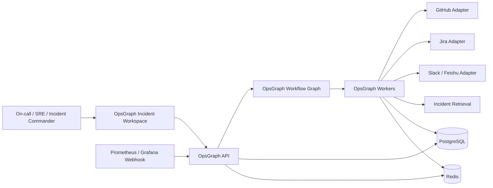

# OpsGraph Architecture

- Version: v0.1
- Date: 2026-03-16
- Scope: Incident response multi-agent workflow built on the shared platform kernel

## 1. Architecture Summary

`OpsGraph` is a domain module on top of the shared platform kernel. It owns alert intake, incident workspace behavior, context enrichment, hypothesis generation, runbook recommendations, communication drafts, and postmortem/replay logic. It does not own auth, general workflow persistence, queueing, model routing, or core observability primitives.

v1 is optimized for:

1. `Prometheus / Grafana` alert intake
2. `GitHub + Jira + Slack/飞书` enrichment and output
3. Human-approved recommendations and communication
4. Replayable incident workflows with strong evidence tracking

## 2. Domain Design Drivers

1. The first responder must get useful context fast
2. Incident records must remain coherent across multiple alerts and updates
3. Facts, hypotheses, and recommendations must be separated
4. Communication drafts can only use confirmed facts
5. Every run must be replayable for regression testing

## 3. Bounded Context and Dependencies

### OpsGraph-Owned Domain Capabilities

1. Alert intake and deduplication
2. Incident workspace lifecycle
3. Context enrichment from GitHub, Jira, and historical incidents
4. Hypothesis ranking and validation suggestions
5. Runbook recommendations
6. Communication draft generation
7. Postmortem generation and replay packaging

### Shared Platform Dependencies

1. Auth and RBAC
2. LangGraph runtime and approval tasks
3. Connector framework
4. Memory and retrieval foundation
5. Audit log and observability stack
6. Replay execution infrastructure

## 4. Context Diagram

## 5. Major Components

### 5.1 Alert Intake Service

Responsibilities:

1. Accept alert webhooks
2. Normalize labels and source payloads
3. Derive correlation keys for deduplication
4. Decide whether to create a new incident or append to an existing one

### 5.2 Incident Workspace Service

Responsibilities:

1. Hold incident state, severity, owner, and current status
2. Maintain signal list, confirmed facts, hypotheses, recommendations, and timeline
3. Provide the single source of truth for UI and downstream generation

### 5.3 Context Enrichment Service

Responsibilities:

1. Fetch recent deployments and relevant commits
2. Fetch linked Jira tickets and change records
3. Load service owner, escalation path, historical incidents, and runbooks
4. Materialize a structured context bundle for the workflow

### 5.4 Hypothesis Engine

Responsibilities:

1. Generate ranked root-cause hypotheses
2. Separate evidence from inference
3. Suggest verification actions for each hypothesis
4. Update rankings as new facts arrive

### 5.5 Runbook Advisor

Responsibilities:

1. Recommend investigation steps and safe actions
2. Categorize actions into `read_only`, `low_risk`, and `high_risk`
3. Require human approval for anything beyond informational guidance

### 5.6 Communication Draft Service

Responsibilities:

1. Generate internal status updates
2. Generate external status page drafts
3. Generate closure communication
4. Enforce that draft content references only confirmed facts

### 5.7 Postmortem and Replay Service

Responsibilities:

1. Convert timeline and decisions into a draft postmortem
2. Capture incident replay cases for regression testing
3. Score future workflow versions against historical incidents

## 6. Domain Data Model

| Entity | Purpose |
| --- | --- |
| `service_registry` | Service metadata, owners, and escalation routes |
| `incident` | Main incident record |
| `signal` | Raw or normalized alert signal |
| `incident_signal_link` | Mapping between signals and incident |
| `context_bundle` | Cached enrichment snapshot |
| `incident_fact` | Explicit confirmed fact |
| `hypothesis` | Candidate root cause |
| `verification_step` | Suggested validation step for hypothesis |
| `runbook_recommendation` | Suggested action or investigation path |
| `approval_task` | Shared-platform approval record for risky actions or communication |
| `comms_draft` | Draft message for internal or external audiences |
| `timeline_event` | Ordered incident history |
| `postmortem` | Generated retrospective artifact |

### Key Fields

1. `incident`
   - `severity`
   - `status`
   - `service_id`
   - `opened_at`
   - `resolved_at`
2. `signal`
   - `source`
   - `fingerprint`
   - `labels`
   - `fired_at`
   - `dedupe_key`
3. `incident_fact`
   - `fact_type`
   - `statement`
   - `source_refs`
   - `confirmed_by`
4. `hypothesis`
   - `rank`
   - `confidence`
   - `rationale`
   - `evidence_refs`
   - `status`
5. `runbook_recommendation`
   - `risk_level`
   - `action_type`
   - `requires_approval`
   - `linked_hypothesis_id`

## 7. Workflow Graph

### 7.1 States

The v1 graph is fixed as:

1. `detect`
2. `triage`
3. `enrich`
4. `hypothesize`
5. `advise`
6. `communicate`
7. `resolve`
8. `retrospective`

### 7.2 State Responsibilities

1. `detect`
   Validates webhook payload and creates normalized signal.
2. `triage`
   Deduplicates, groups, and assigns incident severity suggestion.
3. `enrich`
   Builds current context bundle from connectors and memory.
4. `hypothesize`
   Generates ranked root-cause candidates and verification steps.
5. `advise`
   Produces runbook recommendations and approval tasks if needed.
6. `communicate`
   Generates drafts using only confirmed facts.
7. `resolve`
   Captures resolution metadata and final confirmed root cause.
8. `retrospective`
   Builds timeline, postmortem draft, and replay package.

### 7.3 Pause and Resume Rules

1. Graph pauses for severity confirmation if triage confidence is low
2. Graph pauses before publishing communication externally
3. Graph pauses before any non-read-only action marked `approval_required`
4. Graph resumes when new facts or decisions are submitted

## 8. Async Job Design

### Job Types

1. `opsgraph.alert.normalize`
2. `opsgraph.alert.cluster`
3. `opsgraph.context.enrich`
4. `opsgraph.hypothesis.generate`
5. `opsgraph.runbook.rank`
6. `opsgraph.comms.generate`
7. `opsgraph.postmortem.generate`
8. `opsgraph.replay.score`

### Queue Strategy

1. `hot_path`
   Alert normalization, incident lookup, initial enrichment
2. `default`
   Hypothesis generation and comms drafts
3. `analysis`
   Postmortem generation, replay runs, backfills

### Latency Goal

The `hot_path` queue must let a high-priority incident produce its first actionable context within two minutes end to end.

## 9. Retrieval and Memory

### Retrieval Strategy

OpsGraph uses hybrid retrieval across:

1. Incident history
2. Service metadata
3. Runbooks
4. Deployment records
5. Jira issues

### Memory Layers

1. `Service memory`
   Dependency notes, known failure modes, stable owners, common runbooks
2. `Team memory`
   Escalation norms, communication templates, past RCA learnings
3. `Incident short-term memory`
   Confirmed facts, pending questions, approved actions, active hypotheses

### Retrieval Inputs

The hypothesis engine reads:

1. Current alert labels and signal history
2. Recent deployments and related tickets
3. Similar historical incidents by service and symptom pattern
4. Existing runbooks and service memory

## 10. API Surface

### External REST Endpoints

1. `POST /api/v1/opsgraph/alerts/prometheus`
2. `POST /api/v1/opsgraph/alerts/grafana`
3. `GET /api/v1/opsgraph/incidents`
4. `GET /api/v1/opsgraph/incidents/:incidentId`
5. `POST /api/v1/opsgraph/incidents/:incidentId/facts`
6. `POST /api/v1/opsgraph/incidents/:incidentId/severity`
7. `POST /api/v1/opsgraph/incidents/:incidentId/hypotheses/:id/confirm`
8. `POST /api/v1/opsgraph/approvals/:approvalId/decision`
9. `POST /api/v1/opsgraph/incidents/:incidentId/comms/:draftId/publish`
10. `POST /api/v1/opsgraph/incidents/:incidentId/resolve`
11. `POST /api/v1/opsgraph/replays/run`

### Domain Events

1. `opsgraph.signal.ingested`
2. `opsgraph.incident.created`
3. `opsgraph.incident.updated`
4. `opsgraph.context.ready`
5. `opsgraph.hypothesis.generated`
6. `opsgraph.approval.requested`
7. `opsgraph.comms.ready`
8. `opsgraph.postmortem.ready`

## 11. Frontend Workbench Architecture

### Main Screens

1. `Incident List`
2. `Incident Workspace`
3. `Hypothesis Board`
4. `Runbook Panel`
5. `Communication Center`
6. `Replay Lab`

### Key UI Modules

1. `SignalTimeline`
   Ordered signal and event stream
2. `FactPanel`
   Confirmed facts with source links
3. `HypothesisBoard`
   Ranked candidate root causes and validation steps
4. `RecommendationPanel`
   Runbook guidance grouped by risk level
5. `CommsComposer`
   Internal and external drafts with publish gating
6. `ResolutionSummary`
   RCA, mitigations, and follow-up actions

### Live Updates

1. New signal arrival
2. Incident severity/status changes
3. Context enrichment completion
4. Hypothesis ranking updates
5. Approval task state changes

All live updates flow through SSE from the shared platform event stream.

## 12. Security and Governance

1. Webhook endpoints validate source signatures and idempotency keys
2. Only `operator` or stronger roles can resolve incidents or publish drafts
3. `high_risk` recommendations always create an approval task
4. Communication drafts store the exact fact set used at generation time
5. Every manual override becomes an audit log and feedback event

## 13. Failure Modes and Recovery

1. Duplicate alert storms
   Dedupe by correlation key and time window before new incident creation
2. Connector timeout during enrichment
   Proceed with partial context and display missing-source warnings
3. Weak hypotheses
   Keep them marked `unconfirmed`, never auto-convert into facts
4. Publish failure
   Preserve approved draft and allow re-publish without regenerating
5. Worker crash mid-incident
   Resume from workflow checkpoint and replay pending jobs idempotently

## 14. Testing and Evaluation

### Required Test Layers

1. Webhook normalization and dedupe unit tests
2. Incident state transition integration tests
3. Hypothesis schema and evidence validation tests
4. Communication faithfulness tests
5. Replay regression tests on historical incidents

### Offline Evaluation

1. Incident grouping accuracy
2. Hypothesis top-k hit rate
3. Recommendation usefulness and risk classification accuracy
4. Communication draft adoption and faithfulness

### Release Gate

No model or prompt change ships if:

1. Hypothesis top-k hit rate regresses beyond threshold
2. Communication draft faithfulness drops
3. High-risk approval policy tests fail

## 15. Implementation Order

1. Alert intake and incident workspace
2. Context enrichment connectors
3. Hypothesis engine
4. Runbook recommendation and approval flow
5. Communication draft service
6. Resolution and postmortem service
7. Replay and regression suite
