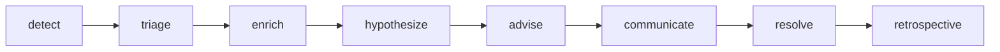

# OpsGraph Workflow Contracts

- Version: v0.1
- Date: 2026-03-16
- Scope: `OpsGraph` LangGraph state, node contracts, specialist agents, and recovery rules

## 1. Contract Summary

This document defines the executable workflow protocol for the `OpsGraph` domain.

The v1 graph is:

1. `detect`
2. `triage`
3. `enrich`
4. `hypothesize`
5. `advise`
6. `communicate`
7. `resolve`
8. `retrospective`

The workflow is optimized for:

1. Fast incident creation from inbound signals
2. Partial but usable context enrichment
3. Separation of facts, hypotheses, and recommendations
4. Human-controlled high-risk actions and customer-visible communication

## 2. Top-Level State Objects

### 2.1 `IncidentWorkflowState`

All OpsGraph nodes operate on the following domain state patch over the shared workflow envelope.

| Field | Type | Required | Purpose |
| --- | --- | --- | --- |
| `ops_workspace_id` | `UUID` | Yes | Workspace root |
| `incident_id` | `UUID` | Yes | Incident root |
| `service_id` | `UUID|null` | No | Resolved service if known |
| `incident_status` | `string` | Yes | Mirrors `incident.status` |
| `severity` | `string` | Yes | Current incident severity |
| `severity_confidence` | `number|null` | No | Triage confidence |
| `signal_ids` | `UUID[]` | Yes | Signals correlated in this run |
| `context_bundle_id` | `UUID|null` | No | Latest context snapshot |
| `context_missing_sources` | `string[]` | Yes | Timed-out or failed enrich sources |
| `current_fact_set_version` | `integer` | Yes | Current confirmed fact version |
| `confirmed_fact_ids` | `UUID[]` | Yes | Facts confirmed during current run |
| `hypothesis_ids` | `UUID[]` | Yes | Hypotheses created during current run |
| `top_hypothesis_ids` | `UUID[]` | Yes | Ordered shortlist |
| `recommendation_ids` | `UUID[]` | Yes | Recommendations produced |
| `pending_approval_task_ids` | `UUID[]` | Yes | High-risk or publish approvals |
| `comms_draft_ids` | `UUID[]` | Yes | Drafts generated in this run |
| `publish_ready_draft_ids` | `UUID[]` | Yes | Drafts safe to publish |
| `postmortem_id` | `UUID|null` | No | Generated retrospective artifact |
| `replay_case_id` | `UUID|null` | No | Replay case attached/generated |
| `resolve_requested` | `boolean` | Yes | True when a resolve command has been supplied |

### 2.2 `FactGate`

Used to ensure the workflow never advances customer-visible communication on a stale fact set.

```json
{
  "required_fact_set_version": 3,
  "current_fact_set_version": 3,
  "is_satisfied": true
}
```

## 3. Specialist Agent Contracts

### 3.1 `triage_agent`

Purpose:

1. Cluster incoming signals
2. Suggest severity
3. Summarize likely incident blast radius

Structured output:

```json
{
  "dedupe_group_key": "checkout-api:high-error-rate",
  "severity": "sev1",
  "severity_confidence": 0.82,
  "title": "Elevated 5xx on checkout-api",
  "service_id": "uuid"
}
```

### 3.2 `investigator_agent`

Purpose:

1. Analyze current context bundle
2. Generate ranked hypotheses
3. Suggest verification steps

Structured output:

```json
{
  "hypotheses": [
    {
      "title": "Recent deploy introduced connection pool exhaustion.",
      "confidence": 0.78,
      "rank": 1,
      "evidence_refs": [
        {
          "kind": "deployment",
          "id": "deploy-123"
        }
      ],
      "verification_steps": [
        {
          "step_order": 1,
          "instruction_text": "Check DB connection saturation metrics."
        }
      ]
    }
  ]
}
```

### 3.3 `runbook_advisor`

Purpose:

1. Propose investigation or mitigation steps
2. Classify risk level
3. Flag approval-required actions

Structured output:

```json
{
  "recommendations": [
    {
      "recommendation_type": "mitigate",
      "risk_level": "high_risk",
      "requires_approval": true,
      "title": "Roll back deployment 123",
      "instructions_markdown": "Revert checkout-api deploy 123."
    }
  ]
}
```

### 3.4 `comms_agent`

Purpose:

1. Generate internal and external drafts
2. Bind each draft to one fixed fact set version
3. Refuse unsupported claims

Structured output:

```json
{
  "drafts": [
    {
      "channel_type": "internal_slack",
      "fact_set_version": 3,
      "body_markdown": "We are investigating elevated error rates..."
    }
  ]
}
```

### 3.5 `postmortem_reviewer`

Purpose:

1. Build a retrospective from facts and timeline
2. Propose replay capture inputs
3. Generate follow-up action items

Structured output:

```json
{
  "postmortem_markdown": "At 09:00 UTC, checkout-api began returning...",
  "follow_up_actions": [],
  "should_create_replay_case": true
}
```

## 4. Graph and Transition Rules



Transition invariants:

1. `triage` must always follow `detect`
2. `communicate` may only use confirmed facts
3. `resolve` requires at least one confirmed root-cause fact or explicit equivalent resolution fact
4. `retrospective` only runs after incident status becomes `resolved`

## 5. Node Contracts

### 5.1 `detect`

Node kind: `state_init`

Enter conditions:

1. Trigger type is `webhook`, `api_command`, or `system_replay`

State inputs:

1. Raw webhook payload ref or existing signal ids

DB reads:

1. `idempotency_key`
2. `external_connection` for webhook secret lookup

DB writes:

1. Insert `signal`
2. Create or update `incident`
3. Insert `incident_signal_link`
4. Append `timeline_event` with `signal_received`

Tools used:

1. None

Agent used:

1. None

Output patch:

1. `incident_id = resolved incident id`
2. `signal_ids += ingested signal ids`
3. `incident_status = open or investigating`

Events emitted:

1. `opsgraph.signal.ingested`
2. `opsgraph.incident.created` when new incident created

Checkpoint policy:

1. After incident and signal rows commit

Retry policy:

1. Retry transient DB failure
2. No retry on invalid webhook payload

Exit conditions:

1. Every accepted signal is linked to an incident

Next state:

1. `triage`

### 5.2 `triage`

Node kind: `analysis`

Enter conditions:

1. At least one signal exists for the incident

State inputs:

1. `signal_ids`

DB reads:

1. `incident`
2. `signal`
3. `service_registry`
4. Historical incident memory

DB writes:

1. Update `incident.title`
2. Update `incident.severity`
3. Update `incident.dedupe_group_key`
4. Append `timeline_event` if severity is changed

Tools used:

1. None external; retrieval only

Agent used:

1. `triage_agent`

Output patch:

1. `severity`
2. `severity_confidence`
3. `service_id`

Pause behavior:

1. If `severity_confidence` is below threshold, enter domain `human_input_gate`
2. Gate reason: `severity_confirmation_required`
3. Resume via `POST /api/v1/opsgraph/incidents/:incidentId/severity`

Events emitted:

1. `opsgraph.incident.updated`

Checkpoint policy:

1. After incident severity/title update
2. Before entering low-confidence input gate

Retry policy:

1. Retry transient model failure
2. No retry on schema violation

Next state:

1. `enrich`

### 5.3 `enrich`

Node kind: `analysis`

Enter conditions:

1. Incident exists and triage has completed

State inputs:

1. `incident_id`
2. `service_id`
3. `signal_ids`

DB reads:

1. `service_registry`
2. `service_dependency`
3. Historical `incident`
4. Historical `postmortem`
5. Existing memory records

DB writes:

1. Insert `context_bundle`
2. Update `incident.current_context_bundle_id`

Tools used:

1. GitHub read
2. Jira read
3. Retrieval over historical incidents and runbooks

Agent used:

1. None; connector and retrieval orchestration only

Output patch:

1. `context_bundle_id`
2. `context_missing_sources`

Events emitted:

1. `opsgraph.context.ready`

Checkpoint policy:

1. After context bundle row is committed

Retry policy:

1. Retry connector timeout
2. Continue in partial mode if at least one context source succeeds
3. If all context sources fail, set warning and continue with minimal incident context

Next state:

1. `hypothesize`

### 5.4 `hypothesize`

Node kind: `analysis`

Enter conditions:

1. Incident exists
2. Context bundle is present or workflow is in degraded mode

State inputs:

1. `context_bundle_id`
2. `current_fact_set_version`

DB reads:

1. `context_bundle`
2. `signal`
3. `incident_fact`
4. Historical incident memory

DB writes:

1. Insert `hypothesis`
2. Insert `verification_step`
3. Append `timeline_event` with `hypothesis_added`

Tools used:

1. Historical incident retrieval
2. Runbook retrieval

Agent used:

1. `investigator_agent`

Output patch:

1. `hypothesis_ids += created hypothesis ids`
2. `top_hypothesis_ids = ranked top ids`

Events emitted:

1. `opsgraph.hypothesis.generated`

Checkpoint policy:

1. After hypotheses and verification steps are persisted

Retry policy:

1. Retry transient model failure
2. Continue with fewer hypotheses if partial retrieval fails

Next state:

1. `advise`

### 5.5 `advise`

Node kind: `analysis`

Enter conditions:

1. At least one hypothesis exists

State inputs:

1. `top_hypothesis_ids`

DB reads:

1. `hypothesis`
2. `verification_step`
3. `service_registry`
4. `memory_record`

DB writes:

1. Insert `runbook_recommendation`
2. Create `approval_task` for `high_risk` recommendations
3. Append `timeline_event` when approval-required recommendations are created

Tools used:

1. Runbook retrieval

Agent used:

1. `runbook_advisor`

Output patch:

1. `recommendation_ids += created ids`
2. `pending_approval_task_ids += approval-required ids`

Pause behavior:

1. The workflow does not pause for recommendation approval by default
2. Approval tasks are created and surfaced asynchronously
3. Approved recommendations can later inform manual operator actions, but are not auto-executed in v1

Events emitted:

1. `opsgraph.approval.requested` for high-risk recommendations

Checkpoint policy:

1. After recommendations and approval tasks commit

Retry policy:

1. Retry transient model or retrieval failures
2. No retry on invalid recommendation schema

Next state:

1. `communicate`

### 5.6 `communicate`

Node kind: `generation`

Enter conditions:

1. Current incident facts are available
2. `current_fact_set_version` is known

State inputs:

1. `current_fact_set_version`
2. `confirmed_fact_ids`
3. `recommendation_ids`

DB reads:

1. `incident_fact` with `status = confirmed`
2. `incident`
3. `runbook_recommendation`

DB writes:

1. Insert `comms_draft`
2. Create `approval_task` for drafts requiring approval

Tools used:

1. Optional messaging channel metadata lookup only

Agent used:

1. `comms_agent`

Output patch:

1. `comms_draft_ids += created draft ids`
2. `publish_ready_draft_ids += drafts not requiring approval`
3. `pending_approval_task_ids += comms approval task ids`

Fact gate:

1. Generated drafts must bind to `current_fact_set_version`
2. If facts change before publish, publish API must reject with stale fact set error

Events emitted:

1. `opsgraph.comms.ready`
2. `opsgraph.approval.requested` if approval task created

Checkpoint policy:

1. After draft rows commit

Retry policy:

1. Retry transient model failure
2. No retry if there are zero confirmed facts for the targeted channel content

Next state:

1. `resolve`

### 5.7 `resolve`

Node kind: `human_input_gate`

Enter conditions:

1. Communication drafts have been generated or skipped

State inputs:

1. `incident_id`
2. `current_fact_set_version`

DB reads:

1. `incident`
2. `incident_fact`
3. `hypothesis`

DB writes on pause:

1. None

Pause behavior:

1. Set `workflow_run.status = waiting_for_input`
2. Persist `pending_input_gate.reason_code = incident_resolution_required`

Resume triggers:

1. `POST /api/v1/opsgraph/incidents/:incidentId/resolve`

Resume condition:

1. Incident status changed to `resolved`
2. At least one root-cause or equivalent resolution fact is present

DB writes on resume:

1. Update `incident.status = resolved`
2. Update `incident.resolved_at`
3. Append `timeline_event` with `incident_resolved`

Output patch:

1. `incident_status = resolved`
2. `resolve_requested = true`

Checkpoint policy:

1. Before entering wait state
2. Immediately after resolution is confirmed

Retry policy:

1. No retry while waiting
2. On stale updated-at conflict, remain in `resolve`

Next state:

1. `retrospective`

### 5.8 `retrospective`

Node kind: `terminalize`

Enter conditions:

1. Incident is resolved

State inputs:

1. `current_fact_set_version`
2. `confirmed_fact_ids`
3. `recommendation_ids`
4. `comms_draft_ids`

DB reads:

1. `incident`
2. `timeline_event`
3. `incident_fact`
4. `comms_draft`

DB writes:

1. Insert `postmortem`
2. Optionally create or attach `replay_case`
3. Append `timeline_event` with retrospective generation

Tools used:

1. Historical replay fixture creation

Agent used:

1. `postmortem_reviewer`

Output patch:

1. `postmortem_id`
2. `replay_case_id`
3. `incident_status` remains `resolved`

Events emitted:

1. `opsgraph.postmortem.ready`

Checkpoint policy:

1. After postmortem row commit
2. Final checkpoint before workflow completion

Retry policy:

1. Retry transient model failure
2. Retry replay-case persistence failure

Next state:

1. Terminal

## 6. Human Gate Protocols

### 6.1 Severity Confirmation Uses Domain Input Gate

Low-confidence severity does not create a shared approval task in v1.

Reason:

1. The operator will already be inside the incident workspace
2. Severity override is a domain-native action, not a cross-cutting approval process

### 6.2 Recommendation and Publish Approval Use Shared Approval Gate

The following actions use `approval_task`:

1. High-risk recommendations
2. Drafts that require external or policy-based approval before publish

These approvals do not block all incident progress by default, but they gate their specific downstream action.

### 6.3 Resolution Uses Domain Input Gate

Resolution depends on operator judgment and fact validation. It is therefore modeled as explicit domain input rather than approval inbox workflow.

## 7. Failure and Recovery Rules

1. Duplicate alert storm
   Multiple signals may map to one incident; `detect` must stay idempotent
2. All enrich sources fail
   Continue with minimal context and warnings; do not fail the incident workspace
3. Facts change after comms draft creation
   Keep draft row; publish must reject until a new draft is generated
4. Approval rejected for high-risk recommendation
   Recommendation remains `rejected`; workflow continues
5. Worker crash after draft generation but before event publish
   Rehydrate from checkpoint and publish missing outbox events idempotently

## 8. Replay and Test Scenarios

Required test cases:

1. New incident created from Prometheus webhook happy path
2. Duplicate webhook delivery does not create duplicate incident
3. Partial enrichment still yields hypotheses
4. Low-confidence severity pauses and resumes through severity override API
5. High-risk recommendation creates approval task
6. Draft publish rejected on stale fact set
7. Resolve resumes retrospective generation
8. Replay reproduces final hypotheses and postmortem creation

Replay fixtures must capture:

1. Raw alert payloads
2. Context bundle snapshots
3. Confirmed fact decisions
4. Approval outcomes
5. Resolution summary and root-cause fact ids

## 9. Mapping to Existing Docs

1. DB writes map to `[DATABASE.md](D:/project/OpsGraph/DATABASE.md)`
2. User-triggered resumes map to `[API.md](D:/project/OpsGraph/API.md)`
3. Shared gate/runtime semantics map to `[WORKFLOW.md](D:/project/SharedAgentCore/docs/WORKFLOW.md)`
