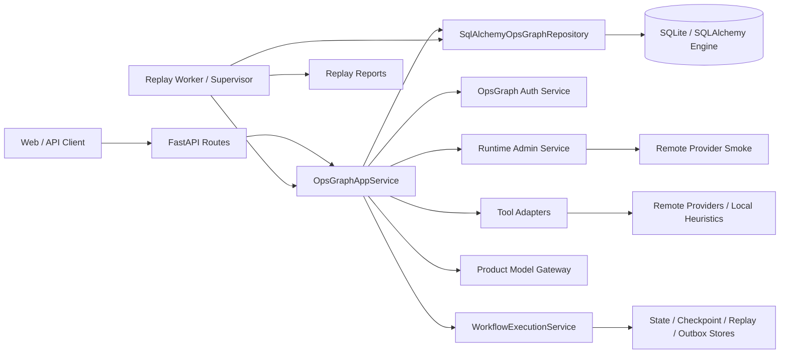
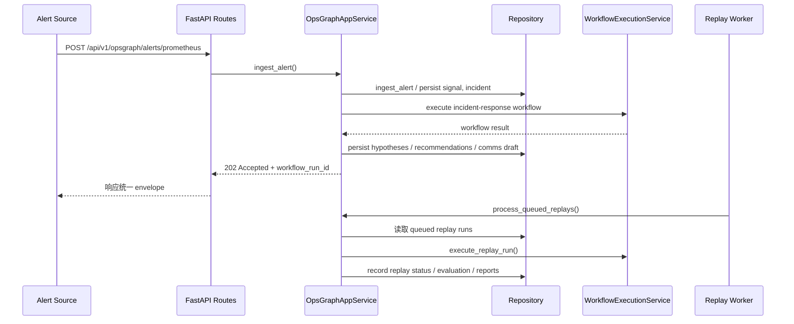

# OpsGraph 项目文档

## 1. 项目概览

### 1.1 项目简介

OpsGraph 是一个围绕运维事件处理闭环构建的产品仓库，当前代码实现覆盖以下主线能力：

- 告警接入：支持 Prometheus 与 Grafana 两类入口。
- 事件响应：围绕 incident 聚合事实、假设、建议、审批与沟通草稿。
- 对外沟通：支持审批后发布 comms，并记录 provider 投递状态。
- 复盘与回放：支持 retrospective、replay case、baseline、evaluation 与报告产物。
- 运行时诊断：支持 remote provider smoke、runtime capability 检查、replay worker 监控与审计。
- 鉴权与组织管理：提供 session、当前用户、组织成员管理能力。

当前应用入口位于 [app.py](D:/project/OpsGraph/src/opsgraph_app/app.py)，核心装配逻辑位于 [bootstrap.py](D:/project/OpsGraph/src/opsgraph_app/bootstrap.py)，HTTP 接口主要位于 [routes.py](D:/project/OpsGraph/src/opsgraph_app/routes.py) 和 [route_replay_monitor.py](D:/project/OpsGraph/src/opsgraph_app/route_replay_monitor.py)。

### 1.2 建设目标

- 将告警接入、分析、处置、沟通、关闭、复盘串成单一工作流闭环。
- 将产品 API、回放 worker、运行时诊断能力放在同一仓库内维护。
- 通过共享 runtime stores、workflow registry 和 replay stores，复用 shared core 平台能力。
- 为后续接入真实远端 provider、模型服务和运营后台打下统一接口基础。

### 1.3 当前实现边界

- 当前仓库已具备可运行的 API、仓储层、worker、回放脚本与测试骨架。
- 默认数据库是内存 SQLite；适合开发、测试和演示，不适合作为生产持久化配置。
- 远端 provider、模型服务均支持环境变量驱动的运行模式切换，但是否真正接入外部系统取决于部署时配置。
- 仓库内未提供 Dockerfile、`docker-compose.yml`、`.env.example` 或 Alembic 迁移脚本。

## 2. 技术栈

### 2.1 语言与依赖

基于 [pyproject.toml](D:/project/OpsGraph/pyproject.toml)：

| 类别 | 技术 |
| --- | --- |
| 语言 | Python 3.12+ |
| Web 框架 | FastAPI |
| 数据校验 | Pydantic v2 |
| ORM / DB | SQLAlchemy 2 |
| HTTP 客户端 | httpx |
| 服务启动 | uvicorn |
| 条件模型接入 | OpenAI Python SDK（代码中按需导入） |

### 2.2 运行时与平台依赖

- 共享平台：`shared_core.agent_platform`
- workflow 装配：通过 shared runtime 加载 workflow registry、prompt service、tool executor、execution service
- 运行时存储：state store、checkpoint store、replay store、outbox store
- 回放产物：文件系统目录 `replay_fixtures/` 与 `replay_reports/`

### 2.3 鉴权与角色

基于 [auth.py](D:/project/OpsGraph/src/opsgraph_app/auth.py)：

- 角色优先级：`viewer < operator < product_admin`
- 角色别名：`org_admin -> product_admin`
- 会话模式：Bearer Session Token
- 默认开发密钥：`opsgraph-dev-secret`

## 3. 目录结构说明

当前仓库的核心目录如下：

```text
OpsGraph/
├── .github/workflows/               CI 工作流
├── replay_fixtures/                 replay 输入样本
├── replay_reports/                  replay 输出报告
├── schemas/remote_provider_contracts/ 远端 provider schema
├── scripts/                         本地运行、CI、schema 生成脚本
│   ├── run_api.py                   标准 API 启动脚本
│   ├── run_demo_workflow.py         演示 incident workflow
│   ├── run_remote_provider_smoke.py remote provider smoke
│   ├── run_replay_report.py         replay 报告
│   └── run_replay_worker.py         replay worker / supervisor
├── shared_core/                     共享运行时与平台代码
├── src/opsgraph_app/                产品主代码
│   ├── app.py
│   ├── auth.py
│   ├── bootstrap.py
│   ├── connectors.py
│   ├── product_gateway.py
│   ├── repository.py
│   ├── repository_runtime_diagnostics.py
│   ├── routes.py
│   ├── route_replay_monitor.py
│   ├── service.py
│   ├── service_runtime_admin.py
│   ├── tool_adapters.py
│   └── worker.py
├── tests/                           单元测试与接口测试
├── AGENT_CONTEXT.md                 内部协作上下文
├── PROMPT_TOOL.md                   提示与工具辅助说明
├── README.md                        项目入口说明
└── pyproject.toml                   依赖与构建配置
```

目录职责：

- `src/opsgraph_app/`：产品实现本体。
- `scripts/`：运行演示流程、回放 worker、CI 检查与 schema 生成。
- `schemas/remote_provider_contracts/`：远端 provider 合同文档生成输出目录。
- `tests/`：覆盖 auth、routes、service、tool adapter、worker、provider smoke 等模块。
- `shared_core/`：多个产品共用的 runtime 基础设施，不建议在产品文档中重复展开其实现细节。

## 4. 架构说明

### 4.1 整体架构



### 4.2 模块装配关系

[bootstrap.py](D:/project/OpsGraph/src/opsgraph_app/bootstrap.py) 负责统一装配：

- 创建 SQLAlchemy Engine
- 创建 shared runtime stores
- 创建 `SqlAlchemyOpsGraphRepository`
- 创建 `SharedPlatformBackedOpsGraphAuthService`
- 注册 product tool adapters
- 创建 `OpsGraphProductModelGateway`
- 创建 `WorkflowExecutionService`
- 创建 API service、应用 service、replay worker、supervisor

当前支持的 workflow 名称固定为：

- `opsgraph_incident_response`
- `opsgraph_retrospective`

### 4.3 核心数据流



## 5. 核心模块详解

### 5.1 应用装配模块

关键文件：

- [app.py](D:/project/OpsGraph/src/opsgraph_app/app.py)
- [bootstrap.py](D:/project/OpsGraph/src/opsgraph_app/bootstrap.py)

关键职责：

- 对外暴露 `create_app()`
- 在开发态默认使用 `sqlite+pysqlite:///:memory:`
- 对 SQLite 设置 `check_same_thread=False`
- 对内存数据库使用 `StaticPool`
- 初始化 replay worker 告警阈值与 smoke 阈值
- 支持通过环境变量注入 bootstrap 管理员账号

### 5.2 路由模块

关键文件：

- [routes.py](D:/project/OpsGraph/src/opsgraph_app/routes.py)
- [route_replay_monitor.py](D:/project/OpsGraph/src/opsgraph_app/route_replay_monitor.py)
- [route_support.py](D:/project/OpsGraph/src/opsgraph_app/route_support.py)
- [route_events.py](D:/project/OpsGraph/src/opsgraph_app/route_events.py)

职责说明：

- 提供认证、健康检查、workflow、事件流、告警接入、incident 协作、回放监控等接口。
- 统一使用 `success_envelope()` 返回 `data + meta` 结构。
- 对领域错误做 HTTP 状态码映射，如 `409` 冲突、`422` 语义错误、`400` 参数错误。
- 通过基于角色的依赖控制 viewer/operator/product_admin 权限。

### 5.3 服务编排模块

关键文件：

- [service.py](D:/project/OpsGraph/src/opsgraph_app/service.py)
- [service_runtime_admin.py](D:/project/OpsGraph/src/opsgraph_app/service_runtime_admin.py)

服务层是系统业务核心，典型能力包括：

- 告警接入：`ingest_alert`
- 事件查询：`list_incidents`、`get_incident_workspace`
- 事实处理：`add_fact`、`retract_fact`
- 研判处理：`override_severity`、`decide_hypothesis`
- 建议与审批：`decide_recommendation`
- 沟通发布：`publish_comms`
- 事件收尾：`resolve_incident`、`close_incident`
- 复盘收尾：`finalize_postmortem`
- 回放执行：`capture_replay_baseline`、`execute_replay_run`、`evaluate_replay_run`
- 运行诊断：`run_remote_provider_smoke`、`list_remote_provider_smoke_runs`
- 运维后台：`get_replay_worker_status`、`update_replay_worker_alert_policy`

### 5.4 仓储模块

关键文件：

- [repository.py](D:/project/OpsGraph/src/opsgraph_app/repository.py)
- [repository_runtime_diagnostics.py](D:/project/OpsGraph/src/opsgraph_app/repository_runtime_diagnostics.py)

职责说明：

- 管理 incident、facts、hypotheses、recommendations、approval tasks、comms drafts 等持久化对象。
- 维护 replay、baseline、evaluation、worker 状态、monitor preset 等后台数据。
- 负责幂等键、审计日志、上下文包、memory record、artifact blob 等辅助对象。
- 在仓库初始化时通过 `Base.metadata.create_all(engine)` 自动建表。

### 5.5 鉴权模块

关键文件：

- [auth.py](D:/project/OpsGraph/src/opsgraph_app/auth.py)

职责说明：

- 维护组织、用户、成员关系、会话表。
- 支持登录、刷新、撤销当前 session。
- 支持组织级成员创建与角色调整。
- 在内存数据库开发模式下，支持 header auth fallback 与 demo auth seed。

### 5.6 连接器、模型网关与工具适配模块

关键文件：

- [connectors.py](D:/project/OpsGraph/src/opsgraph_app/connectors.py)
- [product_gateway.py](D:/project/OpsGraph/src/opsgraph_app/product_gateway.py)
- [tool_adapters.py](D:/project/OpsGraph/src/opsgraph_app/tool_adapters.py)

远端 provider 能力：

- `deployment_lookup`
- `service_registry`
- `runbook_search`
- `change_context`
- `comms_publish`

这些 provider 统一支持的环境变量模式包括：

- `{PREFIX}_PROVIDER` 或 `{PREFIX}_FETCH_MODE`
- `{PREFIX}_URL_TEMPLATE`
- `{PREFIX}_ALLOW_FALLBACK`
- `{PREFIX}_TIMEOUT_SECONDS`
- `{PREFIX}_HEADERS_JSON`
- `{PREFIX}_AUTH_TYPE`
- `{PREFIX}_AUTH_TOKEN`
- `{PREFIX}_USERNAME`
- `{PREFIX}_PASSWORD`
- `{PREFIX}_CONNECTION_ID`
- `{PREFIX}_BACKEND_ID`

模型网关支持：

- 启发式本地模式
- OpenAI 模式
- fallback 策略与超时配置

### 5.7 回放 Worker 与监控页面

关键文件：

- [worker.py](D:/project/OpsGraph/src/opsgraph_app/worker.py)
- [route_replay_monitor.py](D:/project/OpsGraph/src/opsgraph_app/route_replay_monitor.py)
- [replay_worker_monitor_page.py](D:/project/OpsGraph/src/opsgraph_app/replay_worker_monitor_page.py)
- [replay_worker_monitor_page.template.html](D:/project/OpsGraph/src/opsgraph_app/replay_worker_monitor_page.template.html)

职责说明：

- 处理 queued replay run
- 支持 supervisor 轮询执行
- 记录 heartbeat、worker status 与 admin audit log
- 允许以预设、班次和值班策略驱动监控页面展示

## 6. API 文档

### 6.1 通用约定

- 成功响应结构：

```json
{
  "data": {},
  "meta": {
    "request_id": "optional",
    "has_more": false,
    "next_cursor": "optional",
    "workflow_run_id": "optional"
  }
}
```

- 分页采用 cursor 方式，默认页大小 `20`，最大 `100`。
- 认证主要通过 `Authorization: Bearer <token>`。
- Viewer 可读，Operator 可执行事件操作，Product Admin 可执行后台管理操作。

### 6.2 接口列表

按 [routes.py](D:/project/OpsGraph/src/opsgraph_app/routes.py) 与 [route_replay_monitor.py](D:/project/OpsGraph/src/opsgraph_app/route_replay_monitor.py) 统计，当前共 **68** 个 HTTP 接口。

#### 6.2.1 认证、健康与运行时接口

| 方法 | 路径 | 说明 |
| --- | --- | --- |
| POST | `/api/v1/auth/session` | 创建登录会话 |
| POST | `/api/v1/auth/session/refresh` | 刷新访问令牌 |
| DELETE | `/api/v1/auth/session/current` | 撤销当前会话 |
| GET | `/api/v1/auth/me` | 获取当前用户 |
| GET | `/api/v1/auth/memberships` | 查询组织成员 |
| POST | `/api/v1/auth/memberships` | 新增组织成员 |
| PATCH | `/api/v1/auth/memberships/{membership_id}` | 更新成员角色或状态 |
| GET | `/health` | 健康检查 |
| GET | `/api/v1/opsgraph/runtime-capabilities` | 查看 runtime capability |
| POST | `/api/v1/opsgraph/runtime/remote-provider-smoke` | 触发 smoke 测试 |
| GET | `/api/v1/opsgraph/runtime/remote-provider-smoke-runs` | 查看 smoke 运行记录 |
| GET | `/api/v1/opsgraph/runtime/remote-provider-smoke-summary` | 查看 smoke 汇总 |
| GET | `/api/v1/workflows` | 查看 workflow 列表 |
| GET | `/api/v1/workflows/{workflow_run_id}` | 查询 workflow 执行结果 |
| GET | `/api/v1/events/stream` | 订阅事件流 |

#### 6.2.2 告警与 Incident 接口

| 方法 | 路径 | 说明 |
| --- | --- | --- |
| POST | `/api/v1/opsgraph/alerts/prometheus` | 接收 Prometheus 告警 |
| POST | `/api/v1/opsgraph/alerts/grafana` | 接收 Grafana 告警 |
| GET | `/api/v1/opsgraph/incidents` | 分页查询 incident |
| GET | `/api/v1/opsgraph/incidents/{incident_id}` | 获取 incident 工作区 |
| GET | `/api/v1/opsgraph/incidents/{incident_id}/hypotheses` | 查看假设列表 |
| POST | `/api/v1/opsgraph/incidents/{incident_id}/facts` | 新增事实 |
| POST | `/api/v1/opsgraph/incidents/{incident_id}/facts/{fact_id}/retract` | 撤回事实 |
| POST | `/api/v1/opsgraph/incidents/{incident_id}/severity` | 覆盖严重级别 |
| POST | `/api/v1/opsgraph/incidents/{incident_id}/hypotheses/{hypothesis_id}/decision` | 对假设做决策 |
| GET | `/api/v1/opsgraph/incidents/{incident_id}/recommendations` | 查看建议列表 |
| GET | `/api/v1/opsgraph/incidents/{incident_id}/approval-tasks` | 查看审批任务 |
| GET | `/api/v1/opsgraph/incidents/{incident_id}/audit-logs` | 查看事件审计日志 |
| GET | `/api/v1/opsgraph/approval-tasks/{approval_task_id}` | 查看审批任务详情 |
| POST | `/api/v1/opsgraph/approvals/{approval_task_id}/decision` | 执行审批决策 |
| POST | `/api/v1/opsgraph/incidents/{incident_id}/recommendations/{recommendation_id}/decision` | 对建议做决策 |
| GET | `/api/v1/opsgraph/incidents/{incident_id}/comms` | 查看沟通草稿 |
| POST | `/api/v1/opsgraph/incidents/{incident_id}/comms/{draft_id}/publish` | 发布沟通内容 |
| POST | `/api/v1/opsgraph/incidents/{incident_id}/resolve` | 标记 incident 已解决 |
| POST | `/api/v1/opsgraph/incidents/{incident_id}/close` | 关闭 incident |
| GET | `/api/v1/opsgraph/incidents/{incident_id}/postmortem` | 获取复盘记录 |
| POST | `/api/v1/opsgraph/incidents/{incident_id}/postmortem/finalize` | 固化复盘 |
| GET | `/api/v1/opsgraph/postmortems` | 查询复盘列表 |
| POST | `/api/v1/opsgraph/incidents/respond` | 触发 incident response workflow |
| POST | `/api/v1/opsgraph/incidents/retrospective` | 触发 retrospective workflow |

#### 6.2.3 Replay 与评估接口

| 方法 | 路径 | 说明 |
| --- | --- | --- |
| GET | `/api/v1/opsgraph/replay-cases` | 查询 replay case 列表 |
| GET | `/api/v1/opsgraph/replay-cases/{replay_case_id}` | 查询 replay case 详情 |
| POST | `/api/v1/opsgraph/replays/run` | 创建 replay run |
| GET | `/api/v1/opsgraph/replays` | 查询 replay runs |
| GET | `/api/v1/opsgraph/replays/baselines` | 查询 baseline 列表 |
| POST | `/api/v1/opsgraph/replays/baselines/capture` | 采集 baseline |
| POST | `/api/v1/opsgraph/replays/process-queued` | 批量处理排队 replay |
| POST | `/api/v1/opsgraph/replays/{replay_run_id}/status` | 更新 replay 状态 |
| POST | `/api/v1/opsgraph/replays/{replay_run_id}/execute` | 执行 replay |
| POST | `/api/v1/opsgraph/replays/{replay_run_id}/evaluate` | 评估 replay 结果 |
| GET | `/api/v1/opsgraph/replays/summary` | 查询 replay 汇总 |
| GET | `/api/v1/opsgraph/replays/reports` | 查询 replay 报告 |

#### 6.2.4 Replay Worker 监控接口

| 方法 | 路径 | 说明 |
| --- | --- | --- |
| GET | `/api/v1/opsgraph/replays/worker-alert-policy` | 获取 worker 告警策略 |
| PATCH | `/api/v1/opsgraph/replays/worker-alert-policy` | 更新 worker 告警策略 |
| GET | `/api/v1/opsgraph/replays/worker-monitor-presets` | 查询监控预设 |
| GET | `/api/v1/opsgraph/replays/worker-monitor-shift-schedule` | 查询班次配置 |
| PUT | `/api/v1/opsgraph/replays/worker-monitor-shift-schedule` | 更新班次配置 |
| DELETE | `/api/v1/opsgraph/replays/worker-monitor-shift-schedule` | 清空班次配置 |
| GET | `/api/v1/opsgraph/replays/worker-monitor-resolved-shift` | 解析当前班次 |
| PUT | `/api/v1/opsgraph/replays/worker-monitor-presets/{preset_name}` | 新增或更新预设 |
| GET | `/api/v1/opsgraph/replays/worker-monitor-default-preset` | 获取默认预设 |
| PUT | `/api/v1/opsgraph/replays/worker-monitor-default-preset/{preset_name}` | 设置默认预设 |
| DELETE | `/api/v1/opsgraph/replays/worker-monitor-default-preset` | 清空默认预设 |
| DELETE | `/api/v1/opsgraph/replays/worker-monitor-presets/{preset_name}` | 删除预设 |
| GET | `/api/v1/opsgraph/replays/audit-logs` | 查询 replay 后台审计日志 |
| GET | `/api/v1/opsgraph/replays/worker-status` | 查询 worker 状态 |
| GET | `/api/v1/opsgraph/replays/worker-status/stream` | 订阅 worker 状态流 |

## 7. 数据库与数据模型

### 7.1 数据库概览

- 默认连接串：`sqlite+pysqlite:///:memory:`
- SQLite 特殊处理：`check_same_thread=False`
- 内存数据库连接池：`StaticPool`
- 自动建表入口：
  - [repository.py](D:/project/OpsGraph/src/opsgraph_app/repository.py)
  - [auth.py](D:/project/OpsGraph/src/opsgraph_app/auth.py)

当前 ORM Row 模型共 **32** 张表，其中：

- 产品业务表 28 张
- 认证与组织表 4 张

### 7.2 核心数据模型

#### 表概览

| 表名 | 作用 |
| --- | --- |
| `opsgraph_incident` | incident 主表 |
| `opsgraph_incident_fact` | 事实记录 |
| `opsgraph_hypothesis` | 假设记录 |
| `opsgraph_recommendation` | 建议记录 |
| `opsgraph_approval_task` | 审批任务 |
| `opsgraph_comms_draft` | 对外沟通草稿 |
| `opsgraph_timeline_event` | 事件时间线 |
| `opsgraph_audit_log` | incident 维度审计日志 |
| `opsgraph_replay_admin_audit_log` | replay 管理审计日志 |
| `opsgraph_remote_provider_smoke_run` | smoke 测试记录 |
| `opsgraph_signal_index` | 告警索引 |
| `opsgraph_signal` | 原始信号或归一化告警记录 |
| `opsgraph_context_bundle` | 上下文包 |
| `opsgraph_memory_record` | 记忆记录 |
| `opsgraph_artifact_blob` | 产物存储 |
| `opsgraph_idempotency_key` | 幂等键 |
| `opsgraph_postmortem` | 复盘记录 |
| `opsgraph_replay_case` | replay 用例 |
| `opsgraph_replay_run` | replay 执行记录 |
| `opsgraph_replay_baseline` | replay baseline |
| `opsgraph_replay_evaluation` | replay 评估结果 |
| `opsgraph_replay_worker_status` | worker 状态快照 |
| `opsgraph_replay_worker_alert_policy` | worker 告警阈值 |
| `opsgraph_replay_worker_monitor_preset` | 监控预设 |
| `opsgraph_replay_worker_monitor_default_preset` | 默认预设 |
| `opsgraph_replay_worker_monitor_shift_default_preset` | 班次默认预设 |
| `opsgraph_replay_worker_monitor_shift_schedule` | 班次计划 |
| `opsgraph_replay_worker_heartbeat` | worker 心跳 |
| `opsgraph_auth_organization` | 组织表 |
| `opsgraph_auth_user` | 用户表 |
| `opsgraph_auth_membership` | 成员关系表 |
| `opsgraph_auth_session` | 登录会话表 |

#### 核心表字段说明

1. `opsgraph_incident`

- 聚合标识：`incident_id`
- 组织与工作区：`organization_id`、`workspace_id`
- 事件属性：`title`、`severity`、`status`
- 时间字段：`opened_at`、`resolved_at`、`closed_at`
- 来源字段：包括 alert/source 相关引用

2. `opsgraph_incident_fact`

- 主键：`fact_id`
- 归属：`incident_id`
- 内容：事实文本、来源、版本与撤销状态
- 用途：作为假设、建议、沟通、复盘的事实基础

3. `opsgraph_hypothesis`

- 主键：`hypothesis_id`
- 归属：`incident_id`
- 字段：假设内容、置信度、状态、决策信息

4. `opsgraph_recommendation`

- 主键：`recommendation_id`
- 归属：`incident_id`
- 字段：建议内容、状态、执行/审批关联、风险信息

5. `opsgraph_approval_task`

- 主键：`approval_task_id`
- 归属：`incident_id`
- 字段：审批类型、状态、决策结果、关联 recommendation 或 comms draft

6. `opsgraph_comms_draft`

- 主键：`draft_id`
- 归属：`incident_id`
- 字段：channel、content、status、provider_delivery_status、published_at

7. `opsgraph_postmortem`

- 主键：`postmortem_id`
- 归属：`incident_id`
- 字段：结论、root cause、action items、finalized_at

8. `opsgraph_replay_run`

- 主键：`replay_run_id`
- 关联：`incident_id`、`replay_case_id`
- 字段：状态、模型版本、触发方式、开始/结束时间

9. `opsgraph_replay_evaluation`

- 归属：`replay_run_id`
- 字段：语义评估、事实匹配、建议匹配、沟通匹配等指标

10. `opsgraph_remote_provider_smoke_run`

- 主键：`diagnostic_run_id`
- 字段：provider、status、reason、strict_remote_required、diagnostic payload

11. `opsgraph_auth_session`

- 主键：`session_id`
- 字段：`user_id`、`organization_id`、过期时间、refresh 数据

### 7.3 迁移说明

- 当前仓库未集成 Alembic。
- 表结构通过 SQLAlchemy metadata 在启动时自动创建。
- 若切换到持久化数据库，建议优先补充正式迁移机制，而不是继续依赖 `create_all()`。

## 8. 环境搭建与本地运行

### 8.1 前置依赖

- Python 3.12+
- PowerShell 或其他可用终端
- 如需使用 OpenAI 模型模式，需要安装 `.[api,ai]` 并配置 API Key

### 8.2 初始化步骤

```powershell
# 1. 进入项目
cd D:\project\OpsGraph

# 2. 创建并激活虚拟环境（可选）
python -m venv .venv
.\.venv\Scripts\Activate.ps1

# 3. 安装依赖
python -m pip install --upgrade pip
python -m pip install -e .[api]
python -m pip install -e .[api,ai]  # 如需 OpenAI 路径

# 4. 准备本地环境
Copy-Item .env.example .env

# 5. 运行测试
python -m unittest discover -s tests -t .

# 6. 生成远端 provider schema
python .\scripts\generate_remote_provider_schemas.py

# 7. 运行演示工作流
python .\scripts\run_demo_workflow.py

# 8. 运行 remote provider smoke
python .\scripts\run_remote_provider_smoke.py --include-write --allow-write

# 9. 运行 replay worker
python .\scripts\run_replay_worker.py --seed-run --supervise --iterations 2 --max-idle-polls 1

# 10. 启动 API
python .\scripts\run_api.py --host 127.0.0.1 --port 8000
```

本地脚本默认使用仓库内 `.local/opsgraph.db` 持久化数据库；如需覆盖，可以设置 `OPSGRAPH_DATABASE_URL` 或给脚本显式传入 `--database-url`。

未配置远端 provider 时，`run_remote_provider_smoke.py` 会把本地 fallback 记为 `success` + `local_fallback`；如需把“未接通远端”视为失败，请额外传 `--require-configured`。

### 8.3 主要脚本说明

| 脚本 | 说明 |
| --- | --- |
| `scripts/run_api.py` | 启动 FastAPI API |
| `scripts/run_demo_workflow.py` | 运行演示 incident workflow |
| `scripts/run_remote_provider_smoke.py` | 触发 smoke 检查 |
| `scripts/run_replay_report.py` | 生成 replay 报告 |
| `scripts/run_replay_worker.py` | 启动 worker 或 supervisor |
| `scripts/run_ci_checks.py` | 本地执行 CI 等价检查 |
| `scripts/generate_remote_provider_schemas.py` | 生成 provider schema 文档 |

## 9. 配置项说明

### 9.1 数据库与鉴权

| 配置项 | 说明 |
| --- | --- |
| `OPSGRAPH_ALLOW_HEADER_AUTH_FALLBACK` | 是否允许 header fallback 鉴权 |
| `OPSGRAPH_SEED_DEMO_AUTH` | 是否注入 demo 认证数据 |
| `OPSGRAPH_BOOTSTRAP_ADMIN_EMAIL` | 初始化管理员邮箱 |
| `OPSGRAPH_BOOTSTRAP_ADMIN_PASSWORD` | 初始化管理员密码 |
| `OPSGRAPH_BOOTSTRAP_ADMIN_DISPLAY_NAME` | 初始化管理员显示名 |
| `OPSGRAPH_BOOTSTRAP_ORG_SLUG` | 初始化组织 slug |
| `OPSGRAPH_BOOTSTRAP_ORG_NAME` | 初始化组织名 |

### 9.2 模型与 OpenAI

| 配置项 | 说明 |
| --- | --- |
| `OPSGRAPH_MODEL_PROVIDER` | 模型提供方选择 |
| `OPSGRAPH_MODEL_ALLOW_FALLBACK` | 模型 fallback 开关 |
| `OPSGRAPH_OPENAI_MODEL` | OpenAI 模型名 |
| `OPSGRAPH_OPENAI_BASE_URL` | OpenAI Base URL |
| `OPSGRAPH_OPENAI_TIMEOUT_SECONDS` | OpenAI 调用超时 |

### 9.3 Replay 告警阈值

| 配置项 | 说明 |
| --- | --- |
| `OPSGRAPH_REPLAY_ALERT_WARNING_CONSECUTIVE_FAILURES` | replay worker warning 阈值 |
| `OPSGRAPH_REPLAY_ALERT_CRITICAL_CONSECUTIVE_FAILURES` | replay worker critical 阈值 |
| `OPSGRAPH_REMOTE_SMOKE_ALERT_WARNING_CONSECUTIVE_FAILURES` | smoke warning 阈值 |
| `OPSGRAPH_REMOTE_SMOKE_ALERT_CRITICAL_CONSECUTIVE_FAILURES` | smoke critical 阈值 |

### 9.4 Remote Provider 通用前缀配置

以下前缀会根据 provider 自动展开：

- `OPSGRAPH_DEPLOYMENT_LOOKUP_*`
- `OPSGRAPH_SERVICE_REGISTRY_*`
- `OPSGRAPH_RUNBOOK_SEARCH_*`
- `OPSGRAPH_CHANGE_CONTEXT_*`
- `OPSGRAPH_COMMS_PUBLISH_*`

通用字段见 5.6 节。

## 10. 部署说明

### 10.1 构建

当前仓库使用标准 Python 包方式安装：

```powershell
python -m pip install -e .[api]
```

### 10.2 生产环境启动

仓库提供了标准 API 启动脚本：

```powershell
python .\scripts\run_api.py --host 0.0.0.0 --port 8000
```

如需覆盖数据库，可附加 `--database-url sqlite+pysqlite:///./.local/opsgraph.db`，或者通过 `OPSGRAPH_DATABASE_URL` 提前注入。

### 10.3 Docker 部署

当前仓库未提供 Dockerfile 或 compose 文件。

> ⚠️ 待确认：如果后续要作为长期运行服务部署，建议补充正式镜像构建、持久化数据库配置和外部密钥注入方案。

### 10.4 CI/CD 说明

CI 配置位于：

- [opsgraph-ci.yml](D:/project/OpsGraph/.github/workflows/opsgraph-ci.yml)
- [ci_config.py](D:/project/OpsGraph/scripts/ci_config.py)

CI 主要执行：

1. 安装 `.[api]`
2. 运行 `python scripts/run_ci_checks.py`
3. 在 `run_ci_checks.py` 中继续执行：
   - 单元测试
   - schema 生成校验
   - smoke commands

当前 smoke commands 包括：

- `python scripts/run_demo_workflow.py`
- `python scripts/run_remote_provider_smoke.py --include-write --allow-write`
- `python scripts/run_replay_worker.py --seed-run --supervise --iterations 2 --max-idle-polls 1`

## 11. 测试说明

### 11.1 测试框架

- Python `unittest`
- 接口测试与业务测试均位于 `tests/`

### 11.2 运行测试

```powershell
# 全量测试
python -m unittest discover -s tests -t .

# 远端 provider schema 校验
python .\scripts\generate_remote_provider_schemas.py

# CI 等价检查
python .\scripts\run_ci_checks.py

# 回放 worker 演练
python .\scripts\run_replay_worker.py --seed-run --supervise --iterations 2 --max-idle-polls 1
```

### 11.3 测试结构说明

当前测试文件包括：

- [test_auth.py](D:/project/OpsGraph/tests/test_auth.py)
- [test_bootstrap.py](D:/project/OpsGraph/tests/test_bootstrap.py)
- [test_product_gateway.py](D:/project/OpsGraph/tests/test_product_gateway.py)
- [test_remote_provider_contracts.py](D:/project/OpsGraph/tests/test_remote_provider_contracts.py)
- [test_remote_provider_schemas.py](D:/project/OpsGraph/tests/test_remote_provider_schemas.py)
- [test_remote_provider_smoke.py](D:/project/OpsGraph/tests/test_remote_provider_smoke.py)
- [test_routes.py](D:/project/OpsGraph/tests/test_routes.py)
- [test_service.py](D:/project/OpsGraph/tests/test_service.py)
- [test_tool_adapters.py](D:/project/OpsGraph/tests/test_tool_adapters.py)
- [test_worker.py](D:/project/OpsGraph/tests/test_worker.py)

## 12. 注意事项 & 已知问题

- 本地脚本默认使用 `.local/opsgraph.db` 做持久化；如果直接在库级 API 上不传 `database_url`，仍会退回内存 SQLite。
- 当前仓库未提供 Alembic、Dockerfile 或 compose 文件。
- OpenAI 模式可以通过 `python -m pip install -e .[api,ai]` 启用。
- 远端 provider 是否真正生效取决于环境变量配置；未配置时会回落到本地 heuristic 或 repository-only 行为，remote smoke 会将这类情况标记为 `success` + `local_fallback`。

文档已生成，共 12 个章节，覆盖 68 个 API 接口，32 张数据表。
