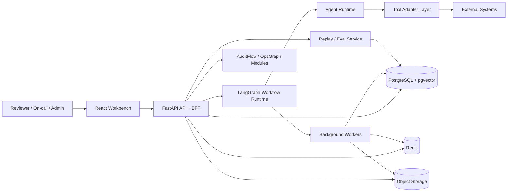
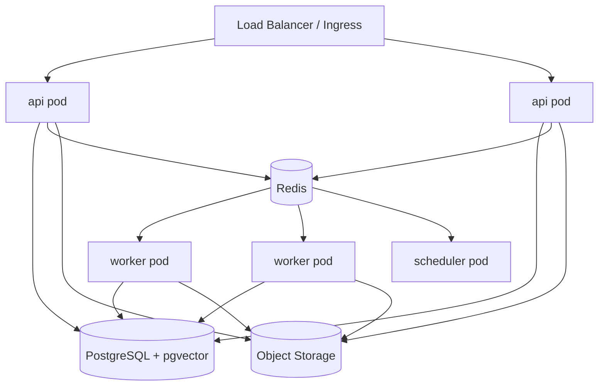

# Shared Platform Architecture

- Version: v0.1
- Date: 2026-03-16
- Scope: Shared runtime and infrastructure for `AuditFlow` and `OpsGraph`

## 1. Architecture Summary

`AuditFlow` and `OpsGraph` will not be built as two unrelated products. v1 uses a shared platform kernel with domain-specific modules on top:

1. One `Python-first` backend runtime
2. One shared `LangGraph` workflow layer
3. One shared `Agent Runtime` and `Tool Adapter` layer
4. One shared `Memory / Retrieval / Eval` foundation
5. Two separate domain modules:
   - `auditflow`
   - `opsgraph`

The deployment model is a modular monolith with separate worker processes, not microservices. This keeps the first release implementable while preserving clean module boundaries.

## 2. Goals and Non-Goals

### Goals

1. Reuse cross-cutting AI platform capabilities across both products
2. Keep v1 architecture simple enough for a small team to build and operate
3. Support long-running workflows, human approvals, replay evaluation, and strong traceability
4. Maintain domain separation so each product can evolve independently

### Non-Goals

1. No microservice split in v1
2. No multi-region deployment in v1
3. No hard dependency on a single LLM vendor
4. No full private-deployment abstraction in v1

## 3. Design Principles

1. `State first`: all important workflow state must be persisted, resumable, and inspectable
2. `Human checkpoints`: any risky action or externally visible output can be held for approval
3. `Evidence over prose`: AI outputs must carry citations, provenance, and trace metadata
4. `Async by default`: ingestion, indexing, mapping, replay, and exports run in background jobs
5. `Domain isolation`: shared platform code cannot embed AuditFlow or OpsGraph business rules
6. `Single write path`: primary truth lives in PostgreSQL; caches and queues are disposable

## 4. Selected Stack

### Backend

1. `FastAPI` for REST API, webhooks, and SSE endpoints
2. `Pydantic v2` for request/response and event schemas
3. `SQLAlchemy 2.x` + `Alembic` for persistence
4. `LangGraph` for workflow orchestration and checkpointed state
5. `Celery` with `Redis` broker for background tasks

### Storage

1. `PostgreSQL 16` as primary OLTP store
2. `pgvector` extension inside PostgreSQL for embeddings and semantic retrieval
3. `Redis` for queue broker, cache, rate limit tokens, and ephemeral coordination
4. `S3-compatible Object Storage` for files, imports, exports, and raw artifacts

### Frontend

1. `React + TypeScript`
2. `Vite` for build tooling
3. `TanStack Query` for server state
4. `SSE` for live workflow and incident updates

### Observability and Ops

1. `OpenTelemetry` for traces, metrics, and logs
2. `Prometheus + Grafana` for service dashboards
3. Structured JSON logs shipped from both API and worker processes

## 5. System Context



## 6. Deployment Topology

v1 deploys as one application stack in a single cloud environment.



### Runtime Processes

1. `api`
   Handles REST, webhooks, approvals, exports, and SSE subscriptions.
2. `worker`
   Executes parsing, indexing, mapping, enrichment, generation, replay, and export jobs.
3. `scheduler`
   Triggers retries, freshness checks, stuck-run recovery, and scheduled re-indexing.

## 7. Platform Modules

### 7.1 API Gateway / BFF

Responsibilities:

1. Authenticate user and resolve active organization/workspace
2. Authorize domain actions via RBAC
3. Expose REST APIs for both products
4. Expose SSE streams for workflow progress and live updates
5. Translate UI-oriented views from underlying domain modules

### 7.2 Workflow Orchestrator

Responsibilities:

1. Start, pause, resume, and cancel `LangGraph` workflow runs
2. Persist graph checkpoints in PostgreSQL
3. Emit step-level trace and audit records
4. Hand off long-running nodes to Celery workers
5. Gate transitions on human approvals when required

### 7.3 Agent Runtime

Responsibilities:

1. Build prompts from domain state, policies, and memory context
2. Execute specialist agents with clear role contracts
3. Enforce structured output schemas
4. Attach citations and source references to every domain assertion
5. Record model inputs, outputs, latency, token usage, and tool calls

### 7.4 Tool Adapter Layer

Responsibilities:

1. Normalize external system access behind internal interfaces
2. Apply connection-specific auth and rate limits
3. Return typed payloads, not raw vendor responses
4. Mark each tool as `read_only`, `approval_required`, or `disabled`

Shared adapter categories:

1. File and object storage
2. Knowledge source connectors
3. Ticket/issue tracker connectors
4. Alert/monitoring connectors
5. Git/deployment connectors
6. Messaging and export connectors

### 7.5 Memory and Retrieval

Responsibilities:

1. Store organization-, service-, and workflow-level learned facts
2. Index documents, chunks, incidents, and reviewer/operator feedback
3. Support lexical and semantic search in a single abstraction
4. Separate short-term workflow state from durable long-term memory

Memory layers:

1. `Session memory`
   Persisted inside workflow state and approval tasks
2. `Operational memory`
   Stored in relational tables for facts, preferences, patterns, and outcomes
3. `Semantic memory`
   Stored as chunk embeddings in `pgvector`

### 7.6 Evaluation and Replay

Responsibilities:

1. Run offline replay against saved workflow inputs
2. Score outputs against labeled or expected results
3. Compare prompt/model/policy versions
4. Publish regression reports before release

### 7.7 Observability and Audit

Responsibilities:

1. Trace every workflow run and step
2. Log model usage, tool invocations, retries, and failures
3. Record human approvals and reviewer/operator decisions
4. Provide latency, queue depth, failure rate, and token cost metrics

## 8. Shared Data Model

The following platform entities are shared across both products.

| Entity | Purpose |
| --- | --- |
| `organization` | Tenant boundary and billing/ownership root |
| `user` | Application identity |
| `membership` | User-to-organization RBAC mapping |
| `workspace` | Product-scoped working container |
| `external_connection` | OAuth/API token metadata and connector config |
| `workflow_run` | Root record for each LangGraph execution |
| `workflow_checkpoint` | Persisted graph state snapshots |
| `workflow_step_run` | Step-level execution details |
| `approval_task` | Human review or approval requirement |
| `artifact` | Generated files, exports, drafts, or raw attachments |
| `memory_record` | Durable learned fact or preference |
| `embedding_chunk` | Searchable chunk with vector embedding |
| `feedback_event` | Human corrections and labels |
| `audit_log` | Immutable security and compliance trail |
| `replay_case` | Saved input for offline evaluation |
| `replay_run` | Actual replay execution with scores |

### Key Platform Fields

1. Every persisted domain record carries `organization_id`
2. Every workflow record carries `workflow_type`, `status`, `started_at`, `ended_at`
3. Every approval task carries `policy`, `requested_by`, `assigned_to`, `decision`
4. Every generated artifact carries `provenance` metadata pointing to workflow run and source records

## 9. API and Event Contracts

### 9.1 Shared API Categories

v1 uses versioned REST APIs:

1. `POST /api/v1/auth/session`
2. `GET /api/v1/me`
3. `GET /api/v1/organizations/:orgId/workspaces`
4. `POST /api/v1/workflows/:workflowType/runs`
5. `GET /api/v1/workflow-runs/:runId`
6. `POST /api/v1/approval-tasks/:taskId/decision`
7. `GET /api/v1/artifacts/:artifactId`
8. `POST /api/v1/feedback`
9. `GET /api/v1/events/stream`

### 9.2 Shared Event Types

All async domain work is driven through a transactional outbox table and then dispatched to workers.

Base event families:

1. `workflow.run.started`
2. `workflow.step.completed`
3. `workflow.step.failed`
4. `approval.requested`
5. `approval.resolved`
6. `artifact.created`
7. `memory.updated`
8. `replay.run.completed`

### 9.3 Idempotency Rules

1. All webhook-style endpoints require an idempotency key
2. All background jobs read from the outbox or job payload and must be safe to retry
3. Connectors store upstream object fingerprints to avoid duplicate imports

## 10. Security and Tenant Isolation

### Authentication

v1 uses app-managed authentication with access token and refresh token sessions. The auth layer is designed so OIDC/SSO can be added later without changing domain modules.

### Authorization

Base roles:

1. `org_admin`
2. `product_admin`
3. `reviewer`
4. `operator`
5. `viewer`

### Isolation

1. Every query is scoped by `organization_id`
2. Object storage keys are prefixed by organization and workspace
3. Search indexes always include organization filter predicates
4. Approval tasks cannot be resolved outside the assignee's organization

### Secrets

1. Connector secrets are stored encrypted at rest
2. Workers never log raw secrets
3. Tool adapters receive short-lived decrypted credentials only at call time

## 11. Reliability and Failure Handling

### Retry Strategy

1. Network and connector failures use bounded exponential backoff
2. Model failures retry only for transient classes, not schema violations
3. Parsing and OCR tasks can be replayed independently without rerunning the full workflow

### Recovery

1. Graph checkpoints allow resume after worker or API restart
2. Long-running workflows can be resumed from the last successful state
3. Stuck runs are detected by scheduler heartbeat and moved to `attention_required`

### Degradation

1. If vector search is unavailable, lexical search remains available
2. If one connector fails, the workflow continues with partial evidence/context and records the gap
3. If generation fails after source retrieval succeeds, user can manually re-run only the generation step

## 12. Proposed Codebase Shape

This is the recommended implementation layout for the shared system:

```text
backend/
  app/
    platform/
      auth/
      workflows/
      agents/
      tools/
      memory/
      eval/
      observability/
    domains/
      auditflow/
      opsgraph/
    api/
    workers/
web/
  src/
    app/
    modules/
      shared/
      auditflow/
      opsgraph/
infra/
  docker/
  migrations/
```

## 13. Testing and Release Gates

### Platform-Level Tests

1. Auth and tenant isolation tests
2. Workflow pause/resume and checkpoint recovery tests
3. Outbox-to-worker delivery tests
4. Tool adapter contract tests
5. Citation/provenance validation tests

### Release Gates

1. No domain run can ship if replay regressions exceed threshold
2. Approval-required actions must be covered by policy tests
3. Each production workflow version must be traceable to prompt/model/config versions

## 14. Build Order

Implementation should follow this order:

1. Platform auth, tenancy, workspace, and audit logging
2. Workflow runtime, approvals, and outbox jobs
3. Object storage and retrieval foundation
4. Shared UI shell and live event stream
5. AuditFlow domain module
6. OpsGraph domain module
7. Replay/eval dashboards and regression automation
